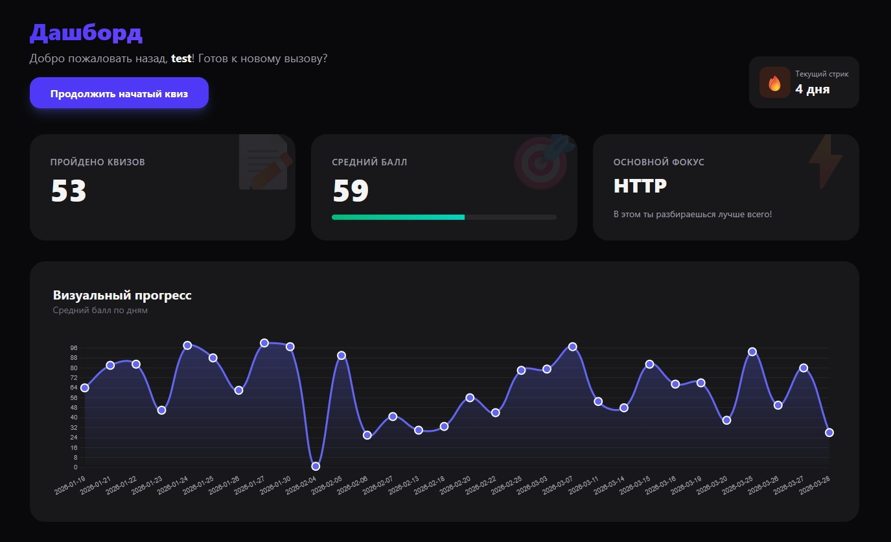

# 🧩 InterVue

**Интерактивная платформа для подготовки к техническим собеседованиям в формате квиза.**

---

## 🌟 О проекте

**InterVue** — это не просто квиз, а комплексный тренажер для разработчиков. Мы объединили классическое тестирование с современными AI-технологиями и интерактивными механиками, чтобы сделать процесс подготовки эффективным и эффектным.

### ✨ Ключевые возможности

Квиз с интерактивными виджетами:

* **🤖 AI-интервьюер** — отвечайте на открытые вопросы и получайте мгновенный фидбэк и оценку от нейросети.
* **🏗️ Конструктор методов** — оттачивайте знание синтаксиса с помощью интуитивного **drag-and-drop** интерфейса.
* **🔍 Анализ кода** — практические задачи по поиску ошибок.
* **✅ Выбор ответов** — классические вопросы с одиночным или множественным выбором.

А также:
* **📊 Дашборд с аналитикой** для отслеживания прогресса.
* **🏆 Лидерборд** для оценки своих результатов в сравнении с другими участниками.

---

## 🛠 Технологический стек

  
  
  
  
  
  
  
  

* **Frontend:** Vue 3 (Composition API), PrimeVue (UI компоненты).
* **Backend:** Node.js с интеграцией OpenAI API для анализа ответов, SQLite для хранения данных.
* **State Management:** Pinia.

---

## 👥 Команда проекта

| Разработчик | Роль | GitHub |
| :--- | :--- | :--- |
| **Andrei Pushchayenka** | Fullstack Developer, Team Lead | [@konfuzz](https://github.com/konfuzz) |
| **Yuriy Barinov** | Fontend Developer | [@bariydev](https://github.com/bariydev) |
| **Ekaterina Golosova** | Frontend Developer | [@roguestone](https://github.com/roguestone) |

---

## 📂 Документация и отчеты

### 📝 Meeting Notes
* 📅 [26 февраля 2026](/meeting-notes/meeting-2026-02-26.md)
* 📅 [06 марта 2026](/meeting-notes/meeting-2026-03-06.md)
* 📅 [27 марта 2026](/meeting-notes/meeting-2026-03-27.md)

### 📺 Видеопрезентации
* 🎥 [Week 5 Checkpoint Video](https://link.storjshare.io/raw/jvfvlz4gh3e3mec62us7qxmepn5a/screenshots/chrome_2026-03-22_19-51-41.mp4)

---

  Built with ❤️ by InterVue Team during RS School course.

